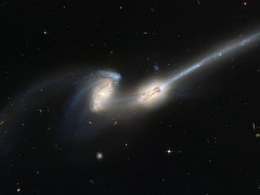
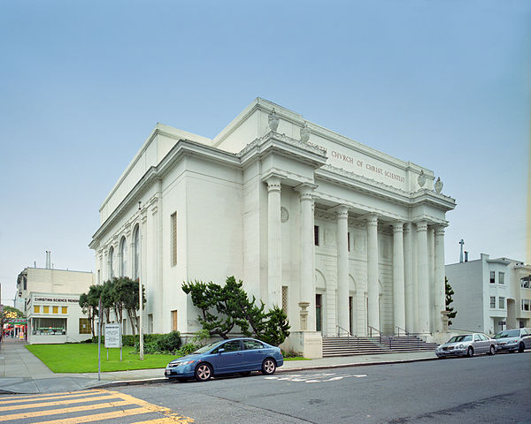
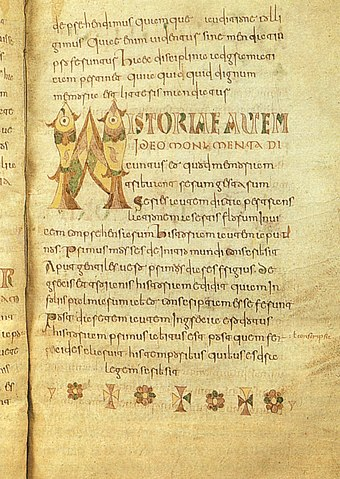

# All Human Knowledge

- [All Human Knowledge](#all-human-knowledge)
    - [Astronomy](#astronomy)
    - [Biology](#biology)
    - [Film and videos](#film-and-videos)
    - [Geography](#geography)
    - [GLAM](#glam)
    - [Literature, languages and publications](#literature-languages-and-publications)
    - [Music](#music)
    - [People](#people)
    - [Photography](#photography)
    - [Software](#software)
    - [Social media](#social-media)
    - [Knowledge preservation](#knowledge-preservation)
    - [Other](#other)
- [Contributing](#contributing)

## Astronomy

According to [ESA](https://www.esa.int/Science_Exploration/Space_Science/Herschel/How_many_stars_are_there_in_the_Universe), the number of galaxies in the observable universe is 2×1012 (two trillion) and as many as 1×1024 stars (more stars than all the grains of sand on planet Earth).

* [Guide Star Catalog](https://archive.stsci.edu/gsc/) - GSC-I contains 19 million stars with apparent magnitudes of 6 to 15. GSC-II is an all-sky catalog of 2 billion stars and galaxies.
* [Messier Catalogue](https://en.wikipedia.org/wiki/Messier_object) - A set of 110 astronomical objects catalogued by Charles Messier.
* [New General Catalgoue](https://en.wikipedia.org/wiki/List_of_NGC_objects) - A set of 7,840 deep-sky objects compiled by John Louis Emil Dreyer.

## Biology

According to [Catalogue of Life](http://www.catalogueoflife.org/col/info/hierarchy#estimates), there are 2.2 million species on the planet known to taxonomists as of 2019.

* [Catalogue of Life](http://www.catalogueoflife.org/) - It holds essential information on the names, relationships and distributions of over 1.8 million species.
* [Encyclopedia of Life](https://eol.org/) - Collaborative encyclopedia intended to document all of living species known to science.
* [WikiSpecies](https://species.wikimedia.org/) - A comprehensive free content catalogue of all species with over 600,000 articles. ([Download](https://dumps.wikimedia.org/specieswiki/latest/)) ([2](https://download.kiwix.org/zim/wikispecies/))
* [World Flora Online](http://www.worldfloraonline.org/) - A compendium of the world's plant species, 1.3 million names, 350,000 accepted species, 55,000 images.

Some related inactive projects are [All Species Foundation](https://en.wikipedia.org/wiki/All_Species_Foundation), [Tree of Life](http://www.tolweb.org/tree/) and [The Plant List](http://www.theplantlist.org/).

## Film and videos

* [IMDb](https://www.imdb.com/) - A database with 5.9 million titles (including episodes) and 9.9 million personalities. ([Download](https://www.imdb.com/interfaces/))
* [Vimeo](https://vimeo.com/) - 
* [YouTube](https://www.youtube.com/) - Over 500 hours of video content are uploaded to YouTube every minute.

## Geography

* [GeoNames](http://www.geonames.org/) - It contains over 25 million geographical names corresponding to over 11 million unique features. ([Download](https://download.geonames.org/export/))
* [OpenStreetMap](https://www.openstreetmap.org/) - ([Download](https://wiki.openstreetmap.org/wiki/Planet.osm))

## GLAM

* [Bibliothèque nationale de France](https://www.bnf.fr/) - 15 million books and publications, 1.5 million sound recordings, 900,000 maps, 260,000 videos. ([Details](https://www.bnf.fr/fr/la-bnf-en-chiffres)) ([Metadata](https://data.bnf.fr/))
* [British Library](https://www.bl.uk/) - 60 million patents, 13.5 million printed books and e-books, 8 million stamps, 7 million sound recordings, 4 million maps, 310,000 manuscripts. ([Details](https://www.bl.uk/about-us/our-story/facts-and-figures-of-the-british-library)) ([Metadata](https://www.bl.uk/collection-metadata/downloads))
* [Library of Congress](https://loc.gov/) - 
* [National Diet Library](https://www.ndl.go.jp/) - 
* [National Library of China](http://www.nlc.cn/) - 
* [National Library of Spain](http://www.bne.es/) - ([Metadata](http://www.bne.es/es/Inicio/Perfiles/Bibliotecarios/DatosEnlazados/DescargaFicheros/))
* [Russian State Library](https://www.rsl.ru/) - 

## Literature, languages and publications

According to [Google](https://booksearch.blogspot.com/2010/08/books-of-world-stand-up-and-be-counted.html) there are 129,864,880 books (considering all editions separately).

* [arXiv](https://arxiv.org/) - A repository of 1.6 million electronic preprints.
* [Internet Archive Books](https://archive.org/details/texts) - 20 million books and texts freely downloadable.
* [Open Library](https://openlibrary.org/) - Project intended to create "one web page for every book ever published". ([Metadata](https://openlibrary.org/developers/dumps))
* [Project Gutenberg](https://www.gutenberg.org/) - A library of over 60,000 free eBooks. ([Download](https://www.gutenberg.org/MIRRORS.ALL)) ([2](https://archive.org/details/gutenberg)) ([3](https://github.com/GITenberg))
* [Rosetta Project](https://rosettaproject.org/) - A disk containing over 13,000 pages of information on over 1,500 human languages.
* [Wiktionary](https://en.wiktionary.org/) - A dictionary with over 6 million entries from over 4,000 languages. ([Download](https://dumps.wikimedia.org/enwiktionary/latest/)) ([2](https://download.kiwix.org/zim/wiktionary/))

## Music

* [Jamendo](https://www.jamendo.com/) - A community of over 42,000 artists and more than 600,000 tracks.
* [SoundCloud](https://soundcloud.com/) - 

## People

* [Find a Grave](https://www.findagrave.com/) - A database of cemetery records, over 152 million burial records and 75 million photos.

## Photography

* [Flickr](https://www.flickr.com/) - It hosts more than 6 billion images as of 2011.
* [Geograph Britain and Ireland](https://www.geograph.org.uk/) - Archive of over 5 million geographically located photographs of Great Britain and Ireland.
* [Wikimedia Commons](https://commons.wikimedia.org/) - A collection of 57 million freely usable media files to which anyone can contribute.

## Social media

* [Facebook](https://www.facebook.com/) - 
* [Instagram](https://www.instagram.com/) - 
* [Telegram](https://telegram.org/) - 
* [Twitter](https://twitter.com/) - 

## Software

* [GitHub](https://github.com/) - 32 million public repositories.
* [Google Code Archive](https://code.google.com/archive/) -  It contains over 1.4 million projects.
* [Software Heritage](https://www.softwareheritage.org/) - It holds over 20 million software projects, with an archive of over 2.7 billion unique source files as of 2016.

Some related inactive projects are [Gitorious](https://gitorious.org/) and [Google Code](https://code.google.com/).

## Knowledge preservation

* [Arch Mission Foundation](https://archmission.org/) - Non-profit organization whose goal is to create multiple redundant repositories of human knowledge around the Solar System, including on Earth. It was founded by Nova Spivack and Nick Slavin in 2015.
* [Archive Team](https://www.archiveteam.org/) - A loose collective of rogue archivists, programmers, writers and loudmouths dedicated to saving digital heritage. Since 2009 this variant force of nature has caught wind of shutdowns, shutoffs, mergers, and plain old deletions - and done their best to save the history before it's lost forever.
* [Arctic World Archive](https://arcticworldarchive.org/) - A world archive to help preserve the world's digital memory and ensure that the world's most irreplaceable digital memories of art, culture and literature are secured and made available to future generations.
* [International Internet Preservation Consortium](http://netpreserve.org/) - International organization of libraries and other organizations established to coordinate efforts to preserve Internet content for the future.
* [Internet Archive](https://archive.org/) - San Francisco–based nonprofit digital library with the stated mission of "universal access to all knowledge." It provides free public access to collections of digitized materials, including websites, software applications/games, music, movies/videos, moving images and books. As of 2019, its collection topped 50 petabytes.
* [Long Now Foundation](http://longnow.org/) - Non-profit organization based in San Francisco that seeks to become the seed of a very long-term cultural institution. It aims to provide a counterpoint to what it views as today's "faster/cheaper" mindset and to promote "slower/better" thinking.
* [Memory of Mankind](https://www.memory-of-mankind.com/) - Preservation project funded in 2012 by Martin Kunze. The main goal is to preserve the knowledge about our present civilization from oblivion and collective amnesia. Information is printed on ceramic tablets, then stored in the salt mine of Hallstatt, Austria. More than a simple archive project, it aims to create the "Time capsule of our era", letting people participate by allowing them to submit texts and images. In contrast to national archives, content for MOM is collected by anyone who takes part. It is a collective, "bottom-up" told history.
* [Memory of the World Programme](https://en.unesco.org/partnerships/partnering/memory-world) - International initiative launched by UNESCO to safeguard the documentary heritage of humanity against collective amnesia, neglect, the ravages of time and climatic conditions, and willful and deliberate destruction. It calls for the preservation of valuable archival holdings, library collections and private individual compendia all over the world for posterity, the reconstitution of dispersed or displaced documentary heritage, and the increased accessibility to and dissemination of these items.
* [Rosetta Project](http://rosettaproject.org/) - A global collaboration of language specialists and native speakers working to develop a contemporary version of the historic Rosetta Stone to last from 2000 to 12,000 AD; it is run by the Long Now Foundation. Its goal is a meaningful survey and near permanent archive of 1,500 languages. Some of these languages have fewer than one thousand speakers left.
* [Voyager Golden Record](http://voyager.jpl.nasa.gov/spacecraft/goldenrec.html) - The Voyager Golden Records are two phonograph records that were included aboard both Voyager spacecraft launched in 1977. The records contain sounds and images selected to portray the diversity of life and culture on Earth, and are intended for any intelligent extraterrestrial life form who may find them.
* [Wikipedia to the Moon](https://meta.wikimedia.org/wiki/Wikipedia_to_the_Moon) - A group of science enthusiasts from Berlin, Germany, are planning to send their own custom-built rover to the Moon. And they want to take Wikipedia with them.

## Other

* [*Natural History*](https://en.wikipedia.org/wiki/Natural_History_(Pliny)) - A book about the whole of the natural world in Latin by Pliny the Elder, a Roman author and naval commander who died in 79 AD. ([Vol 1](https://www.gutenberg.org/ebooks/57493)) ([2](https://www.gutenberg.org/ebooks/60230)) ([3](https://www.gutenberg.org/ebooks/59131)) (4) ([5](https://www.gutenberg.org/ebooks/60688)) (6) ([All](https://en.wikisource.org/wiki/Natural_History_(Rackham,_Jones,_%26_Eichholz)))
* [*Etymologiae*](https://en.wikipedia.org/wiki/Etymologiae) - An etymological encyclopedia, which summarized and organized a wealth of knowledge from hundreds of classical sources, compiled by Isidore of Seville (c. 560–636) towards the end of his life.

## External links

* [All Human Knowledge](https://en.wikipedia.org/wiki/User:Emijrp/All_Human_Knowledge) - Topics and entities notable enough to be included on Wikipedia.

# Contributing

For contributing, [open an issue](https://github.com/emijrp/all-human-knowledge/issues) and/or a [pull request](https://github.com/emijrp/all-human-knowledge/pulls).
